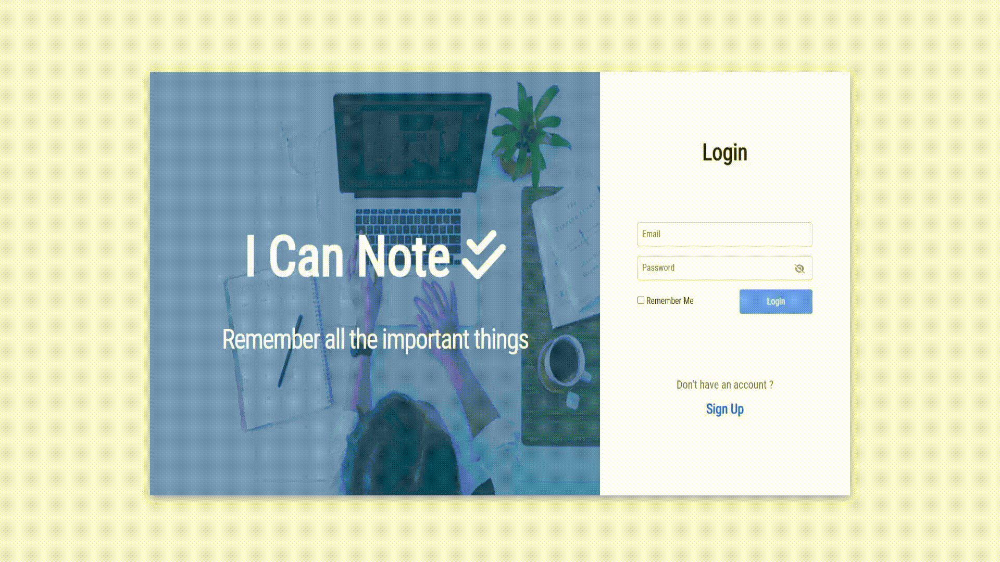

# I Can Note

A useful todo and notepad application with database.

**Live demo: [https://icannote.netlify.app/](https://icannote.netlify.app/)**

## Built with

- [Angular](https://angular.io/)
- [Firebase](https://firebase.google.com/)
- [Bootstrap](https://getbootstrap.com/)
- [SweertAlert2](https://sweetalert2.github.io/)

## Getting Started

Clone the repository

```
git clone https://github.com/AhmedSemih/ICanNote.git
```

After getting the starter files, you need to go the file directory and run

```
npm install
```

and after start the dev server

```
ng serve
```

If you want to use your `Firebase Realtime Database` go to `app/fbconnection.service` and change `Firebase config`.

